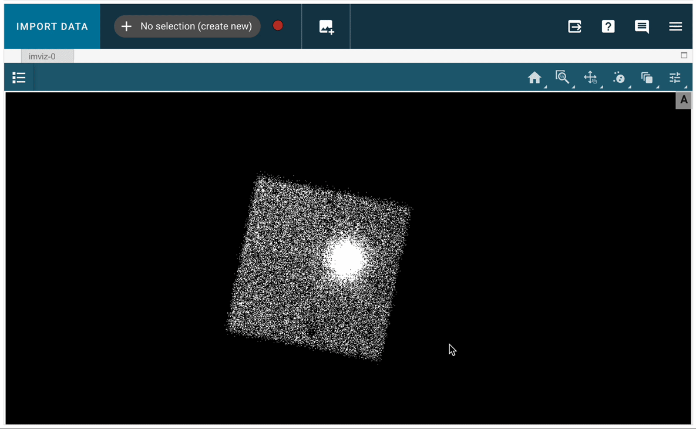

---
jupyter:
  jupytext:
    text_representation:
      extension: .md
      format_name: markdown
      format_version: '1.3'
      jupytext_version: 1.15.2
  kernelspec:
    display_name: (heasoft)
    language: python
    name: heasoft
---

<!-- #region -->
## An Demo for using jdaviz on Sciserver

[jdaviz](https://jdaviz.readthedocs.io/en/latest/) is a package of astronomical data analysis visualization tools based on the Jupyter platform. These GUI-based tools link data visualization and interactive analysis.


`jdaviz` includes several tools. Here, we will focus on using `Imviz`, which is a tool for visualization and quick-look analysis for 2D astronomical images, so it can be used to analyze images, create and modify regions files such as those needed in many X-ray analysis pipelines.

We will walk through the simple steps of using `Imviz` on sciserver. For more details on using the tool, please refer to the main [jdaviz site](https://jdaviz.readthedocs.io/en/latest/).


---

<!-- #endregion -->

Say we are analyzing NuSTAR data of some point source and we want to extract the spectra. We typically need to either pass the source and background selection as RA and DEC positions along with selection region information such as the radius, or we can create the region files for the source and backgorund and pass those to the extraction pipeline. In this example, we will use the latter.

For the purpose of this example, we will copy the cleaned event file for the FMPA detector from the archive. We will use observation `60001084002` of `3C 382`.

Using [`xamin`](https://heasarc.gsfc.nasa.gov/xamin/) to search for NuSTAR observations of `3C 382`, we find that the data for this obsid is located in: `/FTP/nustar/data/obs/00/6//60001084002/`.

First, we use the `extractor` tool from `heasoftpy` to extract an image from the event file

```python
# import heasoftpy to use for image extraction
import heasoftpy as hsp

# Imviz for working with the images
from jdaviz import Imviz
from astropy.wcs import WCS
%matplotlib inline
```

```python
evt_file = '/FTP/nustar/data/obs/00/6//60001084002/event_cl/nu60001084002A01_cl.evt.gz'

inPars = {
    'filename'  : evt_file,
    'eventsout' : 'NONE',
    'imgfile'   : 'nu_image.fits',
    'phafile'   : 'NONE',
    'xcolf'     : 'X',
    'ycolf'     : 'Y',
    'noprompt'  : True
}

# run the task
res = hsp.extractor(**inPars)
```

After the image is extracted, we use `Imviz` to load the image, so we can create the region files.

We now proceed by creating a source and background region.
These are named by default: `Subset 1` and `Subset 2`.
This can be done by first selecting the region button (the circle with two dots inside, the third from the right in the top menu), then creating a region around the source (this will be designated Subset1). To create a new region for the background, select 'No Selection (create new)' from the dropdown list next to 'Import Data', as shown in the following image:



```python
# initlialize the tool
imviz = Imviz()
viewer = imviz.default_viewer


# load the image
imviz.load_data('nu_image.fits')

# display the tool
imviz.show()
```

```python
# customize the viewer
if viewer.shape is not None:
    viewer.zoom(2)
    viewer.set_colormap('Hot')
    viewer.stretch = 'sqrt'
    viewer.cuts = [.5, 30]
```

We now proceed by creating a source and background region.
These are named by default: `Subset 1` and `Subset 2`

The regions can be saved using the following:

```python
regions = imviz.get_interactive_regions()
print(regions)
```

```python
# The following write region files in image units
regions['Subset 1'].write('source.reg', format='ds9', overwrite=True)
regions['Subset 2'].write('background.reg', format='ds9', overwrite=True)

# let's check the created region files:
!cat source.reg
!cat background.reg
```

```python
# To save the image files in WCS coordinates, we can use WCS from astropy
wcs = WCS('nu_image.fits')
regions['Subset 1'].to_sky(wcs=wcs).write('source_wcs.reg', format='ds9', overwrite=True)
regions['Subset 2'].to_sky(wcs=wcs).write('background_wcs.reg', format='ds9', overwrite=True)

# let's check the created region files:
!cat source_wcs.reg
!cat background_wcs.reg
```

These files can now be passed to the `nuproduct` tool to extract the source and background spectra or light curves, as shown in the [NuSTAR light curve notebook](nustar_lightcurve_example.jpynb).

More details on using jdaviz can be found in the [pacakge documentation](https://jdaviz.readthedocs.io/en/latest/imviz/index.html).

```python

```
