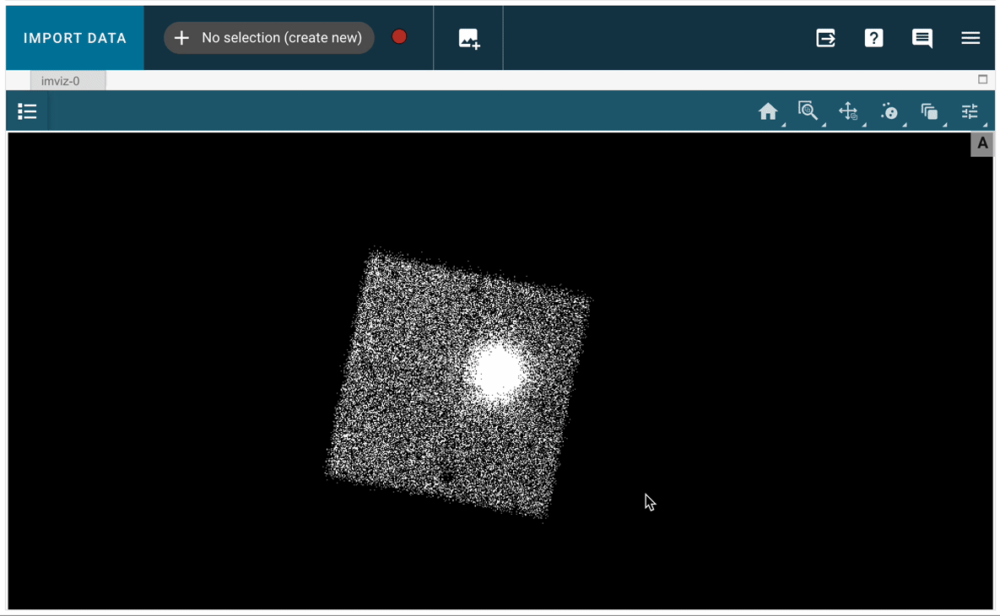

---
jupyter:
  jupytext:
    text_representation:
      extension: .md
      format_name: markdown
      format_version: '1.3'
      jupytext_version: 1.16.0
  kernelspec:
    display_name: (heasoft)
    language: python
    name: heasoft
---

# A Demo for Using jdaviz on Sciserver
<hr style="border: 2px solid #fadbac" />

- **Description:** A demo for using jdaviz for creating region files from an image during data analysis.
- **Level:** Beginner.
- **Data:** NuSTAR observation of **3C 382** (ObsID 60001084002).
- **Requirements:** `heasoftpy`, `jdaviz`, `astropy`
- **Credit:** Kavitha Arur (Jun 2023).
- **Support:** Contact the [HEASARC helpdesk](https://heasarc.gsfc.nasa.gov/cgi-bin/Feedback).
- **Last verified to run:** 02/01/2024.

<hr style="border: 2px solid #fadbac" />

<!-- #region -->
## 1. Introduction

[jdaviz](https://jdaviz.readthedocs.io/en/latest/) is a package of astronomical data analysis visualization tools based on the Jupyter platform. These GUI-based tools link data visualization and interactive analysis.


`jdaviz` includes several tools. Here, we will focus on using `Imviz`, which is a tool for visualization and quick-look analysis for 2D astronomical images, so it can be used to analyze images, create and modify regions files such as those needed in many X-ray analysis pipelines.

We will walk through the simple steps of using `Imviz` on Sciserver. For more details on using the tool, please refer to the main [jdaviz site](https://jdaviz.readthedocs.io/en/latest/).

<div style='color: #333; background: #ffffdf; padding:20px; border: 4px solid #fadbac'>
<b>Running On Sciserver:</b><br>
When running this notebook inside Sciserver, make sure the HEASARC data drive is mounted when initializing the Sciserver compute container. <a href='https://heasarc.gsfc.nasa.gov/docs/sciserver/'>See details here</a>.
<br>
Also, this notebook requires <code>heasoftpy</code> and <code>jdaviz</code>, which are available in the (heasoft) conda environment. You should see (heasoft) at the top right of the notebook. If not, click there and select it.

<b>Running Outside Sciserver:</b><br>
If running outside Sciserver, some changes will be needed, including:<br>
&bull; Make sure heasoftpy and heasoft are installed (<a href='https://heasarc.gsfc.nasa.gov/docs/software/lheasoft/'>Download and Install heasoft</a>).<br>
&bull; Unlike on Sciserver, where the data is available locally, you will need to download the data to your machine.<br>
</div>


<!-- #endregion -->

## 2. Module Imports
We need the following python modules:

```python
# import heasoftpy to use for image extraction
import heasoftpy as hsp

# Imviz for working with the images
from jdaviz import Imviz

# WCS is need to handle image coordinates
from astropy.wcs import WCS

```

## 3. Image Extraction

Say we are analyzing NuSTAR data of some point source and we want to extract the spectra. We typically need to either pass the source and background selection as RA and DEC positions along with selection region information such as the radius, or we can create the region files for the source and backgorund and pass those to the extraction pipeline. In this example, we will use the latter.

For the purpose of this example, we will copy the cleaned event file for the FMPA detector from the archive. We will use observation `60001084002` of `3C 382`.

Using [`xamin`](https://heasarc.gsfc.nasa.gov/xamin/) to search for NuSTAR observations of `3C 382`, we find that the data for this obsid is located in: `/FTP/nustar/data/obs/00/6//60001084002/`.

First, we use the `extractor` tool from `heasoftpy` to extract an image from the event file

```python
evt_file = '/FTP/nustar/data/obs/00/6//60001084002/event_cl/nu60001084002A01_cl.evt.gz'

inPars = {
    'filename'  : evt_file,
    'eventsout' : 'NONE',
    'imgfile'   : 'nu_image.fits',
    'phafile'   : 'NONE',
    'xcolf'     : 'X',
    'ycolf'     : 'Y',
    # noprompt is set so the tool does not prompt for additional parameters
    'noprompt'  : True
}

# run the task
res = hsp.extractor(**inPars)
```

## 4. Create Source and Background Regions

After the image is extracted, we use `Imviz` to load the image, so we can create the region files.

We now proceed by creating a source and background region.
These are named by default: `Subset 1` and `Subset 2`.
This can be done by first selecting the region button (the circle with two dots inside, the third from the right in the top menu), then creating a region around the source (this will be designated Subset1). To create a new region for the background, select 'No Selection (create new)' from the dropdown list next to 'Import Data', as shown in the following image:



```python
# initlialize the tool
imviz = Imviz()
viewer = imviz.default_viewer


# load the image
imviz.load_data('nu_image.fits')

# display the tool
imviz.show()
```

```python
# customize the viewer
if viewer.shape is not None:
    viewer.zoom(2)
    viewer.set_colormap('Hot')
    viewer.stretch = 'sqrt'
    viewer.cuts = [.5, 30]
```

We now proceed by creating a source and background region.
These are named by default: `Subset 1` and `Subset 2`

The regions can be saved using the following:

```python
regions = imviz.get_interactive_regions()
print(regions)
```

### 4.1 Save the Regions in Image Units

```python
# The following write region files in image units
regions['Subset 1'].write('source.reg', format='ds9', overwrite=True)
regions['Subset 2'].write('background.reg', format='ds9', overwrite=True)

# let's check the created region files:
!cat source.reg
!cat background.reg
```

### 4.2 Save the Regions in WCS Coordinates

```python
# To save the image files in WCS coordinates, we can use WCS from astropy
wcs = WCS('nu_image.fits')
regions['Subset 1'].to_sky(wcs=wcs).write('source_wcs.reg', format='ds9', overwrite=True)
regions['Subset 2'].to_sky(wcs=wcs).write('background_wcs.reg', format='ds9', overwrite=True)

# let's check the created region files:
!cat source_wcs.reg
!cat background_wcs.reg
```

These files can now be passed to the `nuproduct` tool to extract the source and background spectra or light curves, as shown in the [NuSTAR light curve notebook](nustar_lightcurve_example.jpynb).

More details on using jdaviz can be found in the [pacakge documentation](https://jdaviz.readthedocs.io/en/latest/imviz/index.html).

```python

```
