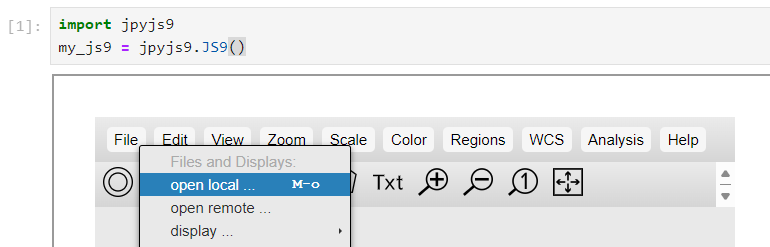
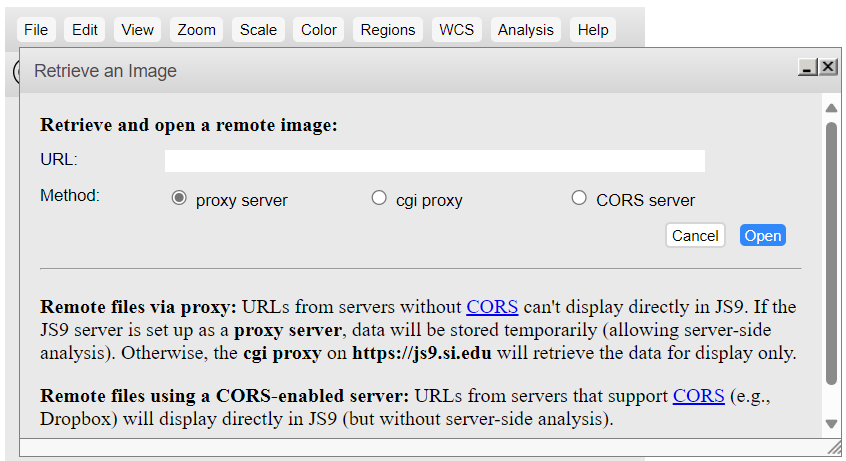
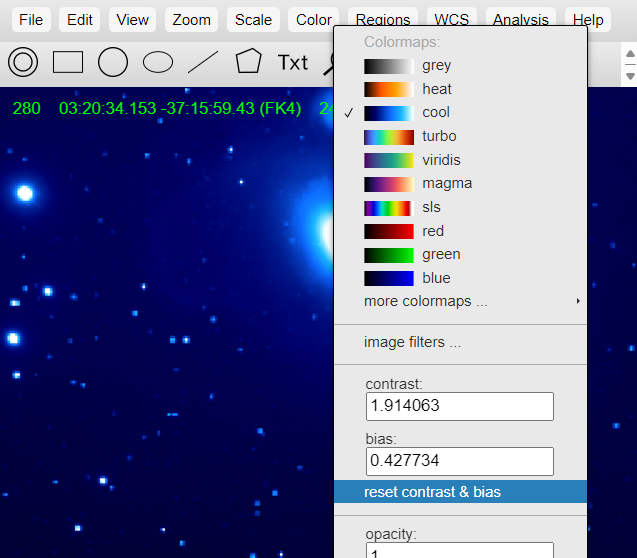
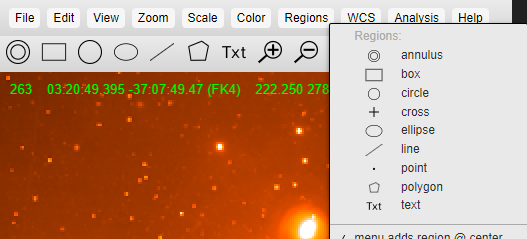
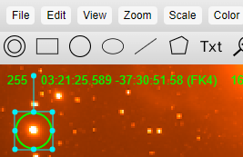
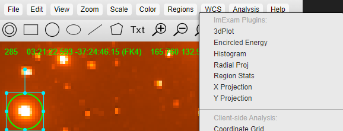
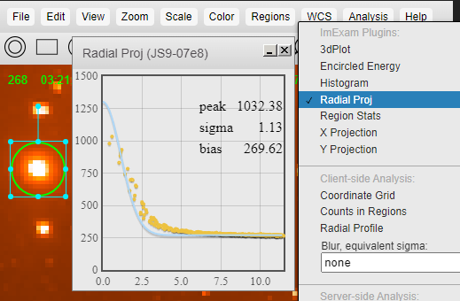

---
jupyter:
  jupytext:
    text_representation:
      extension: .md
      format_name: markdown
      format_version: '1.3'
      jupytext_version: 1.16.0
  kernelspec:
    display_name: (heasoft)
    language: python
    name: conda-env-heasoft-py
---

# A Demo for Using Jupyter-JS9 on Sciserver
<hr style="border: 2px solid #fadbac" />

- **Description:** A demo for using JS9 inside a jupyter notebooks to analyze images.
- **Level:** Intermediate.
- **Data:** An optical image of **NGC 1316**.
- **Requirements:** `jpyjs9`, `js9`. Available on the heasoft environment on sciserver.
- **Credit:** Duy Nguyen (Mar 2024).
- **Support:** Contact the [HEASARC helpdesk](https://heasarc.gsfc.nasa.gov/cgi-bin/Feedback).
- **Last verified to run:** 03/15/2024.

<hr style="border: 2px solid #fadbac" />


## 1. Introduction
`JS9` is a javascript implementation of the common Desktop-based tool, DS9, a tool for visualizing and analyzing astronomical data products originally written by the Center for Astrophysics at the Smithsonian Institute. The NASA HEASARC has modified JS9 to be able to run within a Jupyter Lab context.

We will walk through basic usage of `JS9` on SciServer. For more details on using `JS9`, please refer to the original [JS9 Basics page](https://js9.si.edu/js9/demos/js9basics.html).


## 2. Starting JupyterJS9
To launch Jupyter JS9, invoke the following cell. This will show the tool INLINE, in a window below the cell. You can adjust the area the tool takes by providing `width` and `height` arguments.

```python
import jpyjs9
my_js9 = jpyjs9.JS9(width=600, height=700)
```

You can also show JS9 in a side bar as well, by providing the `side=True` argument:

```python
my_js9 = jpyjs9.JS9(side=True)
```

## 2. The User Interface and Python Helper

The display that is presented to you mirrors the familiar DS9 interface that astronomers have used for decades. Most analysis functions can be found in their appropriate dropdown menus, though the power of running JS9 in a Jupyter context is access to the Python Interface. The `JS9` class that is returned, named `my_js9` in this tutorial, is rich in available Python methods to control the tool. In Python, you can run `dir(my_js9)` to see all the available commands.

In some of the following cells, we will demonstrate how to perform a variety of actions using this Python helper, as well as the User Interface.


## 3. Loading Data
JS9 supports many data formats of astronomical products, including the FITS standard. There are three ways you can load data in JS9:

### 3.1 From your local computer
To load a file from your local computer, open the `File` menu and select `open local`. Your computer will then display a file selector from which you can select a file on disk. 



### 3.2 From a remote source
Under the same `File` menu, you can select `open remote` which will allow you to select a data product from a URL online:



### 3.3 From Python
If your file is accessible from Jupyter (e.g. on Sciserver), you can also load data products that live here via the Python helper. You can for instance upload an image using Jupyter upload feature (under the main text items at the top left) and access them from the notebook. In this example however, we will point to a fits file from the web. Using the `JS9` object that was returned from the first cell, you can invoke:

```python
from astropy.io import fits
#hdul = fits.open('/path/to/my/local/file.fits')
hdul = fits.open('https://js9.si.edu/js9/demos/data/fits/ngc1316.fits')
my_js9.SetFITS(hdul)
```

## 4. Visualization Adjustments
### 4.1 Pan and Zoom
Pan and zoom work very similarly to how they function in DS9.

JS9 supports the same mouse-drag control for panning as in DS9. Using your `right mouse` button, drag while holding `right mouse` to pan your image around.

There also exist a few zoom buttons available in the top tool bar to incrementally adjust the zoom level, and reset your zoom:


You can also adjust the pan and zoom via Python methods. To retrieve the current pan and zoom, you can call `GetPan` and `GetZoom` respectively:

```python
current_pan = my_js9.GetPan()
current_zoom = my_js9.GetZoom()
print(f"Pan: {current_pan}, Zoom: {current_zoom}")
```

Then you can set the pan and zoom using the corresponding `SetPan` and `SetZoom`:

```python
new_pan = current_pan
new_pan['x'] = current_pan['x'] - 25
new_pan['x1'] = current_pan['x1'] - 25
my_js9.SetPan(new_pan)
```

```python
new_zoom = current_zoom * 2
my_js9.SetZoom(new_zoom)
```

### 4.2 Contrast, Bias, and other Color options
There are numerous ways to adjust the contrast and bias of your image.

JS9 supports the same mouse-drag control for contrast and bias as in DS9. Using your `left mouse` button, drag left and right on the image to adjust its bias. Drag up and down to adjust the image's contrast

You can also enter a specific, numerical value within the `Color` Menu. In this same menu, you can select a different colormap for your image:



and lastly, via the Python helper, you can retrieve all three color parameters (colormap, contrast, and bias) via the `GetColormap` method:

```python
my_js9.GetColormap()
```

and you can set any of the three values by the analogous `SetColormap` method

```python
new_colormap = 'heat'
new_contrast = 2
new_bias = 0.4
my_js9.SetColormap(new_colormap, new_contrast, new_bias)
```

## 5. Regions
### 5.1 Defining Regions

`JS9` supports many of the familiar region shapes from DS9. You can see the available regions under the `Regions` dropdown menu:



To draw a region using the JS9 window, select the region shape you would like to draw. This will create a region in the center of the window. Click the region and drag the shape to the location you desire. You can use the resizing points to adjust the shape of your region



You can also use the Python helper to retrieve and define regions as well. To see your defined regions, you can use the `GetRegions` method:

```python
my_regions = my_js9.GetRegions()
my_regions
```

To add a region, you can use the `AddRegions` method:

```python
# Makes a fuchsia-colored copy of the original region
custom_region = my_regions[0]
custom_region['color'] = "#ff00ff"
my_js9.AddRegions(custom_region)
```

and to remove regions, you can use the corresponding `RemoveRegions` method:

```python
my_js9.RemoveRegions("all")
```

### 5.2 Region Analysis

JS9 has a number of Analysis functions built-in for detailed looks at your data. You can find a collection of methods under the `Analysis` tab:



Using the region you just created, for example, you can quickly show the Radial Profile of that region. Select `Radial Proj` and then click on your region of interest will show you the region's Radial Profile:




This concludes the `JS9` tutorial notebook. This is a small subset of the full functionality the tool offers; we encourage you to explore the capabilities.

For more information on NASA's jpyjs9 project please see the project's [GitHub Repository](https://github.com/duytnguyendtn/jpyjs9.git).

For more information on the original JS9 project by the Smithsonian Institute, please visit the [JS9 Homepage](https://js9.si.edu).
