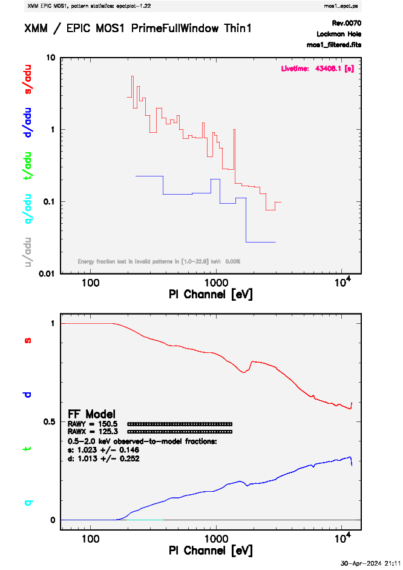
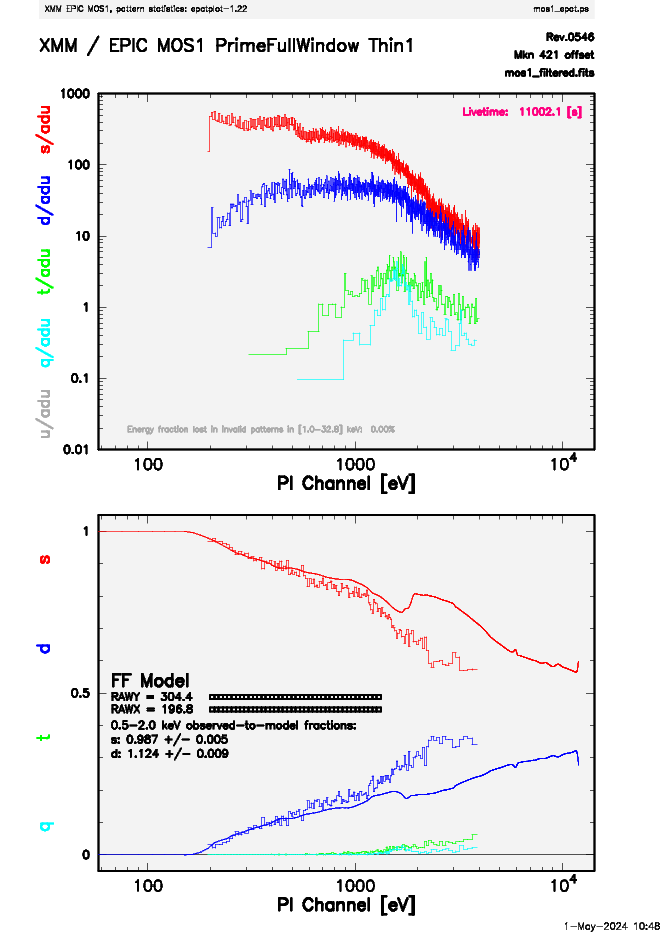

---
jupyter:
  jupytext:
    text_representation:
      extension: .md
      format_name: markdown
      format_version: '1.3'
      jupytext_version: 1.16.0
  kernelspec:
    display_name: (xmmsas)
    language: python
    name: conda-env-xmmsas-py
---

# ABC Guide for XMM-Newton -- Part 2
<hr style="border: 2px solid #fadbac" />

- **Description:** XMM-Newton ABC Guide, Chapter 6, Part 2.
- **Level:** Beginner
- **Data:** XMM observation of the Lockman Hole (obsid=0123700101)
- **Requirements:** Must be run using the `HEASARCv6.33.1` image.  Run in the <tt>(xmmsas)</tt> conda environment on Sciserver. You should see <tt>(xmmsas)</tt> at the top right of the notebook. If not, click there and select <tt>(xmmsas)</tt>.
- **Credit:** Ryan Tanner (April 2024)
- **Support:** <a href="https://heasarc.gsfc.nasa.gov/docs/xmm/xmm_helpdesk.html">XMM Newton GOF Helpdesk</a>
- **Last verified to run:** 1 May 2024, for SAS v21

<hr style="border: 2px solid #fadbac" />


## Introduction
This tutorial is based on Chapter 6 from the The XMM-Newton ABC Guide prepared by the NASA/GSFC XMM-Newton Guest Observer Facility. This notebook assumes you are at least minimally familiar with pySAS on SciServer (see the [Long pySAS Introduction](./analysis-xmm-long-intro.md "Long pySAS Intro")). 

#### SAS Tasks to be Used

- `evselect`[(Documentation for evselect)](https://xmm-tools.cosmos.esa.int/external/sas/current/doc/evselect/index.html)
- `edetect_chain`[(Documentation for edetect_chain)](https://xmm-tools.cosmos.esa.int/external/sas/current/doc/edetect_chain/index.html)
- `atthkgen `[(Documentation for atthkgen)](https://xmm-tools.cosmos.esa.int/external/sas/current/doc/atthkgen/index.html)
- `srcdisplay`[(Documentation for srcdisplay)](https://xmm-tools.cosmos.esa.int/external/sas/current/doc/srcdisplay/index.html)
- `epatplot`[(Documentation for epatplot)](https://xmm-tools.cosmos.esa.int/external/sas/current/doc/epatplot/index.html)
- `backscale`[(Documentation for backscale)](https://xmm-tools.cosmos.esa.int/external/sas/current/doc/backscale/index.html)
- `rmfgen`[(Documentation for rmfgen)](https://xmm-tools.cosmos.esa.int/external/sas/current/doc/rmfgen/index.html)
- `arfgen`[(Documentation for arfgen)](https://xmm-tools.cosmos.esa.int/external/sas/current/doc/arfgen/index.html)

#### Useful Links

- [`pysas` Documentation](https://xmm-tools.cosmos.esa.int/external/sas/current/doc/pysas/index.html "pysas Documentation")
- [`pysas` on GitHub](https://github.com/XMMGOF/pysas)
- [Common SAS Threads](https://www.cosmos.esa.int/web/xmm-newton/sas-threads/ "SAS Threads")
- [Users' Guide to the XMM-Newton Science Analysis System (SAS)](https://xmm-tools.cosmos.esa.int/external/xmm_user_support/documentation/sas_usg/USG/SASUSG.html "Users' Guide")
- [The XMM-Newton ABC Guide](https://heasarc.gsfc.nasa.gov/docs/xmm/abc/ "ABC Guide")
- [XMM Newton GOF Helpdesk](https://heasarc.gsfc.nasa.gov/docs/xmm/xmm_helpdesk.html "Helpdesk") - Link to form to contact the GOF Helpdesk.

<div style='color: #333; background: #ffffdf; padding:20px; border: 4px solid #fadbac'>
<b>Running On Sciserver:</b><br>
When running this notebook inside Sciserver, make sure the HEASARC data drive is mounted when initializing the Sciserver compute container. <a href='https://heasarc.gsfc.nasa.gov/docs/sciserver/'>See details here</a>.
<br><br>
<b>Running Outside Sciserver:</b><br>
This notebook was designed to run on SciServer, but an equivelent notebook can be found on <a href="https://github.com/XMMGOF/pysas">GitHub</a>. You will need to install the development version of pySAS found on GitHub (<a href="https://github.com/XMMGOF/pysas">pySAS on GitHub</a>). There are installation instructions on GitHub and example notebooks can be found inside the directory named 'examples'.
<br>
</div>

<div class="alert alert-block alert-warning">
    <b>Warning:</b> By default this notebook will place observation data files in your <tt>scratch</tt> space. The <tt>scratch</tt> space on SciServer will only retain files for 90 days. If you wish to keep the data files for longer move them into your <tt>persistent</tt> directory.
</div>

```python editable=true slideshow={"slide_type": ""}
# pySAS imports
import pysas
from pysas.wrapper import Wrapper as w

# Importing Js9
import jpyjs9

# Useful imports
import os, subprocess

# Imports for plotting
import matplotlib.pyplot as plt
from astropy.visualization import astropy_mpl_style
from astropy.io import fits
from astropy.wcs import WCS
from astropy.table import Table
plt.style.use(astropy_mpl_style)
```

Now we need to let pySAS know which Obs ID we are working with. If you have already worked through Part 1 of this tutorial then when you run `basic_setup` it will auto-detect the observation files.

```python
obsid = '0123700101'

# To get your user name. Or you can just put your user name in the path for your data.
from SciServer import Authentication as auth
usr = auth.getKeystoneUserWithToken(auth.getToken()).userName

data_dir = os.path.join('/home/idies/workspace/Temporary/',usr,'scratch/xmm_data')
odf = pysas.odfcontrol.ODFobject(obsid)
odf.basic_setup(data_dir=data_dir,overwrite=False,repo='sciserver',rerun=False)
os.chdir(odf.work_dir)

# File names for this notebook. The User can change these file names.
unfiltered_event_list = odf.files['m1evt_list'][0]
temporary_event_list = 'temporary_event_list.fits'
light_curve_file ='mos1_ltcrv.fits'
gti_rate_file = 'gti_rate.fits'
filtered_event_list = 'filtered_event_list.fits'
attitude_file = 'attitude.fits'
soft_band_file = 'mos1-s.fits'
hard_band_file = 'mos1-h.fits'
mos_all_file = 'mos1-all.fits'
eml_list_file = 'emllist.fits'
```

<!-- #region editable=true slideshow={"slide_type": ""} -->
---
If you have already worked through Part 1 of this tutorial you can skip the next cell. But if not, or if you want to run it again, the necessary code from Part 1 is in the cell below.
<!-- #endregion -->

```python editable=true slideshow={"slide_type": ""}
odf.basic_setup(data_dir=data_dir,overwrite=False,repo='sciserver',rerun=False)

os.chdir(odf.work_dir)

# "Standard" Filter
inargs = ['table={0}'.format(unfiltered_event_list), 
          'withfilteredset=yes', 
          "expression='(PATTERN <= 12)&&(PI in [200:4000])&&#XMMEA_EM'", 
          'filteredset={0}'.format(temporary_event_list), 
          'filtertype=expression', 
          'keepfilteroutput=yes', 
          'updateexposure=yes', 
          'filterexposure=yes']

w('evselect', inargs).run()

# Make Light Curve File
inargs = ['table={0}'.format(temporary_event_list), 
          'withrateset=yes', 
          'rateset={0}'.format(light_curve_file), 
          'maketimecolumn=yes', 
          'timecolumn=TIME', 
          'timebinsize=100', 
          'makeratecolumn=yes']

w('evselect', inargs).run()

# Make Secondary GTI File
inargs = ['table={0}'.format(light_curve_file), 
          'gtiset={0}'.format(gti_rate_file),
          'timecolumn=TIME', 
          "expression='(RATE <= 6)'"]

w('tabgtigen', inargs).run()

# Filter Using Secondary GTI File
inargs = ['table={0}'.format(temporary_event_list),
          'withfilteredset=yes', 
          "expression='GTI({0},TIME)'".format(gti_rate_file), 
          'filteredset={0}'.format(filtered_event_list),
          'filtertype=expression', 
          'keepfilteroutput=yes',
          'updateexposure=yes', 
          'filterexposure=yes']

w('evselect', inargs).run()
```

<!-- #region editable=true slideshow={"slide_type": ""} -->
## 6.6 Regions in JS9
<!-- #endregion -->

As in Part 1, we will use a function to create a FITS image file from the filtered event list and open it in JS9. Let us open a JS9 window again.

```python
my_js9 = jpyjs9.JS9(width = 800, height = 800, side=True)
```

```python
def make_fits_image(event_list_file, image_file='image.fits'):
    
    inargs = ['table={0}'.format(event_list_file), 
              'withimageset=yes',
              'imageset={0}'.format(image_file), 
              'xcolumn=X', 
              'ycolumn=Y', 
              'imagebinning=imageSize', 
              'ximagesize=600', 
              'yimagesize=600']

    w('evselect', inargs).run()

    with fits.open(image_file) as hdu:
        my_js9.SetFITS(hdu)
        my_js9.SetColormap('heat',1,0.5)
        my_js9.SetScale("log")
    
    return image_file
```

```python
make_fits_image(filtered_event_list)
```

To create a region, you can either click on the region menu and select a shape, or you can click on a region shape located directly below the menu bar in JS9. Click on the circle to make a circular region. A green circle should appear.

If you click on the circle you can drag it around the image. When you select the region a teal colored box will surround the region to show that it is highlighted. You can resize the region by clicking and dragging any of the points on the selection box.

If you are not familiar with regions in ds9 feel free to add more regions and get comfortable interacting with regions. When you are ready you can clear all regions by running the next cell.

```python
my_js9.RemoveRegions('all')
```

We will now add a single region around a single interesting source.

```python
my_js9.AddRegions("circle", {'px': 26188.5, 'py': 22816.5, 'radius': 3.5})
```

We can get the region information by using the following commands. The `GetRegions()` command will return a list of all regions. In this case we only have one region in the list.

```python
regions = my_js9.GetRegions()
regions
```

We can then select the region we want with its information.

```python
my_region = regions[0]
my_region
```

It may be hard to see the region we have added so we will zoom in. First we will get the current settings.

```python
current_pan = my_js9.GetPan()
current_zoom = my_js9.GetZoom()
print(f"Pan: {current_pan}")
print(f"Zoom: {current_zoom}")
```

Now we will center and zoom in on the region using the location information from the region.

```python
new_pan = current_pan
new_pan['x'] = my_region['x']
new_pan['y'] = my_region['y']
my_js9.SetPan(new_pan)
new_zoom = current_zoom * 4
my_js9.SetZoom(new_zoom)
```

## 6.7 Extract the Source and Background Spectra for a Single Region


Throughout the following, please keep in mind that some parameters are instrument-dependent. The parameter `specchannelmax` should be set to 11999 for the MOS, or 20479 for the PN. Also, for the PN, the most stringent filters, `(FLAG==0)&&(PATTERN<=4)`, must be included in the expression to get a high-quality spectrum.

For the MOS, the standard filters should be appropriate for many cases, though there are some instances where tightening the selection requirements might be needed. For example, if obtaining the best-possible spectral resolution is critical to your work, and the corresponding loss of counts is not important, only the single pixel events should be selected `(PATTERN==0)`. If your observation is of a bright source, you again might want to select only the single pixel events to mitigate pile up (see §6.8 and §6.9 for a more detailed discussion). In any case, you'll need to know spatial information about the area over which you want to extract the spectrum.

Now using `evselect` we can select just the events inside of the region. These events should mostly be from the source we are interested in. We will use the following filtering expression.

`expression='((X,Y) in CIRCLE(26188.5,22816.5,300))'`

The inputs for `evselect` to extract the source spectra are as follows.

	table - the event file
	energycolumn - energy column
	withfilteredset - make a filtered event file
	keepfilteroutput - keep the filtered file
	filteredset - name of output file
	filtertype - type of filter
	expression - expression to filter by
	withspectrumset - make a spectrum
	spectrumset - name of output spectrum
	spectralbinsize - size of bin, in eV
	withspecranges - covering a certain spectral range
	specchannelmin - minimum of spectral range
	specchannelmax - maximum of spectral range

When extracting the background spectrum, follow the same procedures, but change the extraction area. For example, make an annulus around the source; this can be done using two circles, each defining the inner and outer edges of the annulus, then change the filtering expression (and output file name) as necessary. `expression='((X,Y) in CIRCLE(26188.5,22816.5,1500))&&!((X,Y) in CIRCLE(26188.5,22816.5,500))'`

Below we extract both the source and the background spectra. The keywords are as described above.

```python
filtered_source = 'mos1_filtered.fits'
filtered_bkg = 'bkg_filtered.fits'
source_spectra_file = 'mos1_pi.fits'
bkg_spectra_file = 'bkg_pi.fits'

inargs = {'table': '{0}'.format(filtered_event_list),
          'energycolumn': 'PI',
          'withfilteredset': 'yes',
          'filteredset': '{0}'.format(filtered_source),
          'keepfilteroutput': 'yes',
          'filtertype': 'expression',
          'expression': "'((X,Y) in CIRCLE(26188.5,22816.5,300))'",
          'withspectrumset': 'yes',
          'spectrumset': '{0}'.format(source_spectra_file),
          'spectralbinsize': '5',
          'withspecranges': 'yes',
          'specchannelmin': '0',
          'specchannelmax': '11999'}

w('evselect', inargs).run()

inargs = {'table': '{0}'.format(filtered_event_list),
          'energycolumn': 'PI',
          'withfilteredset': 'yes',
          'filteredset': '{0}'.format(filtered_bkg),
          'keepfilteroutput': 'yes',
          'filtertype': 'expression',
          'expression': "'((X,Y) in CIRCLE(26188.5,22816.5,1500))&&!((X,Y) in CIRCLE(26188.5,22816.5,500))'",
          'withspectrumset': 'yes',
          'spectrumset': '{0}'.format(bkg_spectra_file),
          'spectralbinsize': '5',
          'withspecranges': 'yes',
          'specchannelmin': '0',
          'specchannelmax': '11999'}

w('evselect', inargs).run()
```

You might want to automatically generate expressions for your regions using the region information from JS9. Below is some example code on how to automatically generate filtering expressions for both a source and the background.

```python
my_js9.RemoveRegions('all')
my_js9.AddRegions("circle", {'px': 26188.5, 'py': 22816.5, 'radius': 3.5})
my_js9.AddRegions("annulus", {'px': 26188.5, 'py': 22816.5, 'radii': [5,15]})
regions = my_js9.GetRegions()
source_region = regions[0]
bkg_region = regions[1]
source_loc = source_region['lcs']
bkg_loc = bkg_region['lcs']
```

```python
expression = "'((X,Y) in CIRCLE({x:.1f},{y:.1f},{radius:.1f}))'".format(x=source_loc['x'],y=source_loc['y'],radius=source_loc['radius'])
inargs = {'table': '{0}'.format(filtered_event_list),
          'energycolumn': 'PI',
          'withfilteredset': 'yes',
          'filteredset': '{0}'.format(filtered_source),
          'keepfilteroutput': 'yes',
          'filtertype': 'expression',
          'expression': expression,
          'withspectrumset': 'yes',
          'spectrumset': '{0}'.format(source_spectra_file),
          'spectralbinsize': '5',
          'withspecranges': 'yes',
          'specchannelmin': '0',
          'specchannelmax': '11999'}

w('evselect', inargs).run()
```

```python
expression = "((X,Y) in CIRCLE({x:.1f},{y:.1f},{radiuso:.1f}))&&!((X,Y) in CIRCLE({x:.1f},{y:.1f},{radiusi:.1f}))".format(x=bkg_loc['x'],y=bkg_loc['y'],radiuso=bkg_loc['radii'][1],radiusi=bkg_loc['radii'][0])
inargs = {'table': '{0}'.format(filtered_event_list),
          'energycolumn': 'PI',
          'withfilteredset': 'yes',
          'filteredset': '{0}'.format(filtered_bkg),
          'keepfilteroutput': 'yes',
          'filtertype': 'expression',
          'expression': expression,
          'withspectrumset': 'yes',
          'spectrumset': '{0}'.format(bkg_spectra_file),
          'spectralbinsize': '5',
          'withspecranges': 'yes',
          'specchannelmin': '0',
          'specchannelmax': '11999'}

w('evselect', inargs).run()
```

## 6.8 Check for Pile Up


Depending on how bright the source is and what modes the EPIC detectors are in, event pile up may be a problem. Pile up occurs when a source is so bright that incoming X-rays strike two neighboring pixels or the same pixel in the CCD more than once in a read-out cycle. In such cases the energies of the two events are in effect added together to form one event. If this happens sufficiently often, 
1) the spectrum will appear to be harder than it actually is, and
2) the count rate will be underestimated, since multiple events will be undercounted.

To check whether pile up may be a problem, use the SAS task epatplot. Heavily piled sources will be immediately obvious, as they will have a "hole" in the center, but pile up is not always so conspicuous. Therefore, we recommend to always check for it.

<div class="alert alert-block alert-info">
    <b>Note:</b> This procedure requires as input the event file for the source created when the spectrum was made (i.e. 'filtered_source'), not the usual time-filtered event file (i.e. 'filtered_event_list').
</div>

To check for pile up in our Lockman Hole example, run the following cell:

```python
inargs = ['set={0}'.format(filtered_source),
          'plotfile=mos1_epat.ps',
          'useplotfile=yes',
          'withbackgroundset=yes',
          'backgroundset={0}'.format(filtered_bkg)]

w('epatplot', inargs).run()
```

where

    set - input events file 
    plotfile - output postscript file 
    useplotfile - flag to use file name from "plotfile" 
    withbackgroundset - use background event set for background subtraction? 
    backgroundset - name of background event file

The output of `epatplot` is a postscript file, `mos1_epat.ps`, which may be viewed with a postscript viewer such as `gv` (i.e. 'ghostscript viewer'). At the moment there is no way to view a postscript file on SciServer so to view it you will have to download `mos1_epat.ps` to your local machine to view it. If you do not have `gv` installed on your local machine, install it from a terminal using `sudo apt install gv`. Then from the download directory you can run `gv mos1_epat.ps` to view the graphs. In the postscript image there are two graphs describing the distribution of counts as a function of PI channel. You should get a plot like that shown below.


<center></center>


---

A few words about interpretting the plots are in order. The top is the distribution of counts versus PI channel for each pattern class (single, double, triple, quadruple), and the bottom is the expected pattern distribution (smooth lines) plotted over the observed distribution (histogram). The lower plot shows the model distributions for single and double events and the observed distributions. It also gives the ratio of observed-to-modeled events with 1-$\sigma$ uncertainties for single and double pattern events over a given energy range. (The default is 0.5-2.0 keV; this can be changed with the pileupnumberenergyrange parameter.) If the data is not piled up, there will be good agreement between the modeled and observed single and double event pattern distributions. Also, the observed-to-modeled fractions for both singles and doubles in the 0.5-2.0 keV range will be unity, within errors. In contrast, if the data is piled up, there will be clear divergence between the modeled and observed pattern distributions, and the observed-to-modeled fraction for singles will be less than 1.0, and for doubles, it will be greater than 1.0.

Finally, when examining the plots, it should noted that the observed-to-modeled fractions can be inaccurate. Therefore, the agreement between the modeled and observed single and double event pattern distributions should be the main factor in determining if an observation is affected by pile up or not.

The source used in our Lockman Hole example is too faint to provide reasonable statistics for epatplot and is far from being affected by pile up. For comparison, an example of a bright source (Mkn 421, Obs ID: 0136541101) which is strongly affected by pileup is shown below. Note that the observed-to-model fraction for doubles is over 1.0, and there is severe divergence between the model and the observed pattern distribution.


<center></center>


## 6.9 My Observation is Piled Up! Now What?


If you're working with a different (much brighter) dataset that does show signs of pile up, there are a few ways to deal with it. First, using the region selection and event file filtering procedures demonstrated in earlier sections, you can excise the inner-most regions of a source (as they are the most heavily piled up), re-extract the spectrum, and continue your analysis on the excised event file. For this procedure, it is recommended that you take an iterative approach: remove an inner region, extract a spectrum, check with epatplot, and repeat, each time removing a slightly larger region, until the model and observed distribution functions agree. If you do this, be aware that removing too small a region with respect to the instrumental pixel size (1.1'' for the MOS, 4.1'' for the PN) can introduce systematic inaccuracies when calculating the source flux; these are less than 4%, and decrease to less than 1% when the excised region is more than 5 times the instrumental pixel half-size. In any case, be certain that the excised region is larger than the instrumental pixel size!

You can also use the event file filtering procedures to include only single pixel events (PATTERN==0), as these events are less sensitive to pile up than other patterns.


## 6.10 Determine the Spectrum Extraction Areas


Now that we are confident that our spectrum is not piled up, we can continue by finding the source and background region areas. This is done with the task `backscale`, which takes into account any bad pixels or chip gaps, and writes the result into the BACKSCAL keyword of the spectrum table. Alternatively, we can skip running backscale, and use a keyword in arfgen below. We will show both options for the curious.

The inputs for `backscale` are:

    spectrumset - spectrum file
    badpixlocation - event file containing the bad pixels

To find the source and background extraction areas explicitly,

```python
inargs = ['spectrumset={0}'.format(source_spectra_file),
          'badpixlocation=mos1_filt_time.fits']

w('backscale', inargs).run()

inargs = ['spectrumset={0}'.format(bkg_spectra_file),
          'badpixlocation=mos1_filt_time.fits']

w('backscale', inargs).run()
```

## 6.11 Create the Photon Redistribution Matrix (RMF) and Ancillary File (ARF)


Now that a source spectrum has been extracted, we need to reformat the detector response by making a redistribution matrix file (RMF) and ancillary response file (ARF). To make the RMF we use `rmfgen`. The input arguments are:

    rmfset - output file
    spectrumset - input spectrum file

Now we can use `arfgen` with the RMF, spectrum, and event file to make the ancillary file (ARF). The input arguments are:

    arfset - output ARF file name
    spectrumset - input spectrum file name
    withrmfset - flag to use the RMF
    rmfset - RMF file created by rmfgen
    withbadpixcorr - flag to include the bad pixel correction
    badpixlocation - file containing the bad pixel information; should be set to the event file from which the spectrum was extracted.
    setbackscale - flag to calculate the area of the source region and write it to the BACKSCAL keyword in the spectrum header
    
At this point, the spectrum stored in the file `mos1_pi.fits` is ready to be analyzed using an analysis package such as XSPEC.

```python
inargs = {'rmfset': 'mos1_rmf.fits',
          'spectrumset': '{0}'.format(source_spectra_file)}

w('rmfgen', inargs).run()

inargs = {}
inargs = {'arfset': 'mos1_arf.fits',
          'spectrumset': '{0}'.format(source_spectra_file),
          'withrmfset': 'yes',
          'rmfset': 'mos1_rmf.fits',
          'withbadpixcorr': 'yes',
          'badpixlocation': 'mos1_filt_time.fits',
          'setbackscale': 'yes'}

w('arfgen', inargs).run()
```
