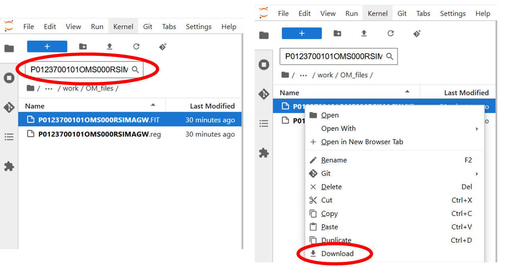
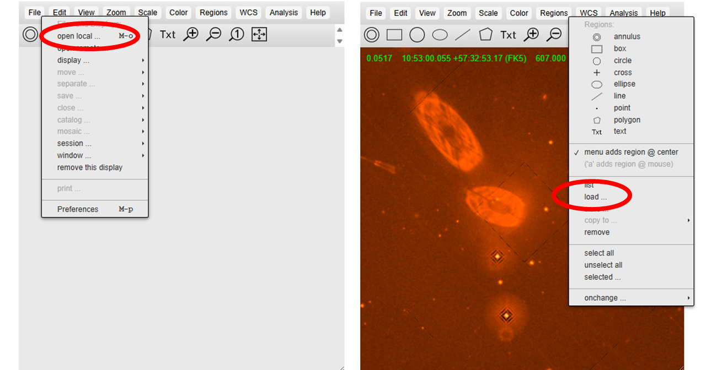
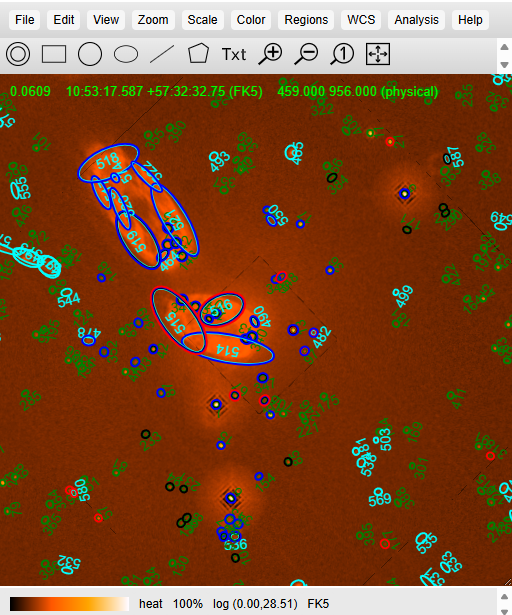

---
jupyter:
  jupytext:
    text_representation:
      extension: .md
      format_name: markdown
      format_version: '1.3'
      jupytext_version: 1.16.0
  kernelspec:
    display_name: (xmmsas)
    language: python
    name: conda-env-xmmsas-py
---

<!-- #region editable=true slideshow={"slide_type": ""} -->
# ABC Guide for XMM-Newton -- Optical Monitor (OM)
<hr style="border: 2px solid #fadbac" />

- **Description:** XMM-Newton ABC Guide, Chapter 12.
- **Level:** Beginner
- **Data:** XMM observation of the Lockman Hole (obsid=0123700101), Mkn 421 (obsid=0411081601), BPM 16274 (obsid=0125320801)
- **Requirements:** Must be run using the `HEASARCv6.35` image. Run in the <tt>(xmmsas)</tt> conda environment on Sciserver. You should see <tt>(xmmsas)</tt> at the top right of the notebook. If not, click there and select <tt>(xmmsas)</tt>.
- **Credit:** Jenna Cann (Feb 2025)
- **Support:** <a href="https://heasarc.gsfc.nasa.gov/docs/xmm/xmm_helpdesk.html">XMM Newton GOF Helpdesk</a>
- **Last verified to run:** 15 March 2025, for SAS v21 and pySAS v1.4.8

<hr style="border: 2px solid #fadbac" />
<!-- #endregion -->

## Introduction
This tutorial is based on Chapter 12 from the The [The XMM-Newton ABC Guide](https://heasarc.gsfc.nasa.gov/docs/xmm/abc/ "ABC Guide") prepared by the NASA/GSFC XMM-Newton Guest Observer Facility. This notebook assumes you are at least minimally familiar with pySAS on SciServer (see the [Long pySAS Introduction](./analysis-xmm-long-intro.md "Long pySAS Intro")). 

#### SAS Tasks to be Used

- [`omichain` Documentation](https://xmm-tools.cosmos.esa.int/external/sas/current/doc/omichain/index.html "omichain Documentation") ("Optical Monitor Imaging Mode Chain") 
- [`omfchain` Documentation](https://xmm-tools.cosmos.esa.int/external/sas/current/doc/omfchain/index.html "omfchain Documentation") ("Optical Monitor Fast Mode Chain")
- [`omgchain` Documentation](https://xmm-tools.cosmos.esa.int/external/sas/current/doc/omgchain/index.html "omgchain Documentation") ("Optical Monitor Grism Chain")

#### Useful Links

- [`pysas` Documentation](https://xmm-tools.cosmos.esa.int/external/sas/current/doc/pysas/index.html "pysas Documentation")
- [`pysas` on GitHub](https://github.com/XMMGOF/pysas)
- [Common SAS Threads](https://www.cosmos.esa.int/web/xmm-newton/sas-threads/ "SAS Threads")
- [Users' Guide to the XMM-Newton Science Analysis System (SAS)](https://xmm-tools.cosmos.esa.int/external/xmm_user_support/documentation/sas_usg/USG/SASUSG.html "Users' Guide")
- [The XMM-Newton ABC Guide](https://heasarc.gsfc.nasa.gov/docs/xmm/abc/ "ABC Guide")
- [XMM Newton GOF Helpdesk](https://heasarc.gsfc.nasa.gov/docs/xmm/xmm_helpdesk.html "Helpdesk") - Link to form to contact the GOF Helpdesk.

<div style='color: #333; background: #ffffdf; padding:20px; border: 4px solid #fadbac'>
<b>Running On Sciserver:</b><br>
When running this notebook inside Sciserver, make sure the HEASARC data drive is mounted when initializing the Sciserver compute container. <a href='https://heasarc.gsfc.nasa.gov/docs/sciserver/'>See details here</a>.
<br><br>
<b>Running Outside Sciserver:</b><br>
This notebook was designed to run on SciServer, but an equivelent notebook can be found on <a href="https://github.com/XMMGOF/pysas">GitHub</a>. You will need to install the development version of pySAS found on GitHub (<a href="https://github.com/XMMGOF/pysas">pySAS on GitHub</a>). There are installation instructions on GitHub and example notebooks can be found inside the directory named 'documentation'.
<br>
</div>

<div class="alert alert-block alert-warning">
    <b>Warning:</b> By default this notebook will place observation data files in your <tt>scratch</tt> space. The <tt>scratch</tt> space on SciServer will only retain files for 90 days. If you wish to keep the data files for longer move them into your <tt>persistent</tt> directory.
</div>


## 12 An OM Data Processing and Analysis Primer


The OM can operate in Imaging, Fast, and Grism mode. Each of these modes has dedicated commands to reprocess the data: omichain, omfchain, and omgchain. These are metatasks that each call several procedures that are used to prepare the data for processing, make and apply flatfield images, and detect sources. The tasks omichain and omfchain also calculate the instrumental magnitudes of sources, find the position of the sources (in equatorial coordinates), and produce a sky image; omgchain produces a spectrum. If you run these chains, it is helpful to inspect the sas_log file to get a detailed list of the performed tasks. These chains rely on filters specified by the user; if no arguments are given, they run on all the files present in the ODF directory. Due to the long file names and the large number of input parameters, users are urged to simply use the chains and not run the chains' individual tasks one at a time.

Most OM data are obtained in Imaging mode. If they were obtained in the Fast mode, there will be an additional event list file corresponding to the Fast window (*FAE.FIT). Reprocessing of data taken in Fast mode using the command line and SAS GUI is discussed in §12.3. Reprocessing OM Grism data is discussed in §12.4.


## 12.1 OM Artifacts and General Information


Before proceeding with this notebook, it is appropriate to discuss the artifacts that often affect OM images. These artifacts can affect the accuracy of a measurement by e.g., increasing the background level.

Stray light - background celestial light is reflected by the OM detector housing onto the center on the OM field of view, producing a circular area of high background. This can also produce looping structures and long streaks.

Modulo 8 noise - In the raw images, a modulo 8 pattern arises from imperfections in the event centroiding algorithm in the OM electronics. This is removed during image processing.

Smoke rings - light from bright sources is reflected from the entrance window back on the detector, producing faint rings located radially away from the center of the field of view.

Out-of-time events - sources with count rates of several tens of counts/sec show a strip of events along the readout direction, corresponding to photons that arrived while the detector was being read out.

Further, artifacts also can contaminate grism data. Due to this mode's complexity, users are urged to be very careful when working with grism data, and should refer to the [SOC's website on this topic](https://xmm-tools.cosmos.esa.int/external/xmm_user_support/documentation/sas_usg/USG/omgnotes.html "SOC's website on this topic").


## 12.2 Imaging mode


#### 12.2.1 Rerunning the Pipeline

```python
# pySAS imports
import pysas
from pysas.wrapper import Wrapper as w

# Importing Js9
import jpyjs9
#from regions import read_ds9

# Useful imports
import os, sys
import numpy as np
from scipy.optimize import curve_fit

# Imports for plotting
import matplotlib.pyplot as plt
from astropy.visualization import astropy_mpl_style
from astropy.io import fits
from astropy.wcs import WCS
from astropy.table import Table
plt.style.use(astropy_mpl_style)
```

```python
obsid = '0123700101'

# To get your user name. Or you can just put your user name in the path for your data.
from SciServer import Authentication as auth
usr = auth.getKeystoneUserWithToken(auth.getToken()).userName

data_dir = os.path.join('/home/idies/workspace/Temporary/',usr,'scratch/xmm_data/')

odf = pysas.odfcontrol.ODFobject(obsid)
odf.basic_setup(data_dir=data_dir,repo='sciserver',overwrite=False,
                run_epproc=False,run_emproc=False,run_rgsproc=False)
```

We will be running a task named `omichain`. This task will creat a large number of files. To keep things organized we will create a subdirectory named `OM_files` within the `work_dir` and run `omichanin` inside that directory. This will keep the optical monitor files separate from the rest of the files for this Obs ID.

<div class="alert alert-block alert-info">
<b>Note:</b> The following cell will take ~25 minutes to run.</div>

```python
# Change in to the work_dir.
os.chdir(odf.work_dir)

# Create om_dir in work_dir
om_dir_name = 'OM_files'
odf.om_dir = os.path.join(odf.work_dir,om_dir_name)
if not os.path.isdir(odf.om_dir):
    os.mkdir(odf.om_dir)
    
# Change into the newly created om_dir
os.chdir(odf.om_dir)

inargs = ["processmosaicedimages=yes"]

w('omichain', inargs).run()
```

You can also run omichain with various parameters  as shown [here](https://xmm-tools.cosmos.esa.int/external/sas/current/doc/omichain/node13.html "here"). As an example, let's try the above with several specific flags related to source detection. Since this will create a whole new set of OM files, we will create a new subdirectory within the `work_dir` and run `omichain` in it with the new parameters.

<div class="alert alert-block alert-info">
<b>Note:</b> The following cell will take ~25 minutes to run.</div>

```python
# Change in to the work_dir.
os.chdir(odf.work_dir)

# Create om_dir in work_dir
om_dir_name = 'OM_files2'
odf.om_dir = os.path.join(odf.work_dir,om_dir_name)
if not os.path.isdir(odf.om_dir):
    os.mkdir(odf.om_dir)
    
# Change into the newly created om_dir
os.chdir(odf.om_dir)

inargs = ["processmosaicedimages=yes", "omdetectnsigma=2.0", "omdetectminsignificance=3.0"]

w('omichain', inargs).run()
```

The flags above include:

    -processmosaicedimages - process the mosaicked sky images?
    -omdetectnsigma - number of sigma above background required for a pixel to be considered part of the source
    -omdetectminsignificance - minimum significance of a source to be included in the source list file

There are numerous output files from the above command, including images and region files for each exposure and filter. If you are interested in a particular filter or set of filters, you can use the flag "filters=" with your desired filters.

Several final output files will have been created during the processing steps. The main ones that you will likely need to worry about are named in the following format:

P[obsid]OMS000RSIMAG[filter].FIT
P[obsid]OMS000RSIMAG[filter].reg

where [obsid] is the nine-digit observation id (in this example 0123700101) and [filter] is the one-letter designation for a given filter. The *IMAG[filter].FIT refers to the mosaic image and the *IMAG[filter].reg is a region file that shows the sources identified in the processing pipeline. The filters are designated by the following letters:

    -M: UVM2
    -L: UVW1
    -S: UVW2
    -U: U
    -B: B
    -V: V
    -W: White

In this obsid, we have observations in UVW1, UVW2, U, V, and White. 

The very last output to the "terminal" from `omichain` is a table of all the files created. It should look like this (lines have been removed):

```
omichain:- ********************************************************
omichain:- Product Files produced by omichain
omichain:- ********************************************************
omichain:-      Type:       Observation source-list file: 
omichain:-  1)  EXPOSURES   P0123700101OMCOMBOBSMLI0000.FIT Asp.corr.: NO
omichain:-  2)     MERGED   P0123700101OMCOMBOBSMER0000.FIT Asp.corr.: NO
omichain:-  3)   MOSAICED   P0123700101OMCOMBOBSMOS0000.FIT Asp.corr.: YES
omichain:- Filter U
omichain:- Mosaiced sky-image=P0123700101OMS000RSIMAGU.FIT, source-list=P0123700101OMS000RSISWSU.FIT
omichain:-             Image file:                  Sky-image file:                Source-list file:
omichain:-  1)   I0123700101OMS005IMAGE30000.FIT  P0123700101OMS005SIMAGE0000.FIT  P0123700101OMS005SWSRLI0000.FIT  Asp.corr.: NO
omichain:-  2)   I0123700101OMS005IMAGE31000.FIT  P0123700101OMS005SIMAGE1000.FIT  P0123700101OMS005SWSRLI1000.FIT Asp.corr.: YES
...
omichain:- 10)   I0123700101OMS422IMAGE31000.FIT  P0123700101OMS422SIMAGE1000.FIT  P0123700101OMS422SWSRLI1000.FIT Asp.corr.: YES
omichain:- Filter UVW2
omichain:- Mosaiced sky-image=P0123700101OMS000RSIMAGS.FIT, source-list=P0123700101OMS000RSISWSS.FIT
omichain:-             Image file:                  Sky-image file:                Source-list file:
omichain:-  1)   I0123700101OMS008IMAGE30000.FIT  P0123700101OMS008SIMAGE0000.FIT  P0123700101OMS008SWSRLI0000.FIT  Asp.corr.: NO
...
omichain:- 10)   I0123700101OMS426IMAGE31000.FIT  P0123700101OMS426SIMAGE1000.FIT  P0123700101OMS426SWSRLI1000.FIT Asp.corr.: YES
omichain:- Filter V
omichain:- Mosaiced sky-image=P0123700101OMS000RSIMAGV.FIT, source-list=P0123700101OMS000RSISWSV.FIT
omichain:-             Image file:                  Sky-image file:                Source-list file:
omichain:-  1)   I0123700101OMS004IMAGE30000.FIT  P0123700101OMS004SIMAGE0000.FIT  P0123700101OMS004SWSRLI0000.FIT  Asp.corr.: NO
...
omichain:-  Tracking-history time-series file:       Tracking-history ps file:      Tracking-history pdf file:
omichain:-  1)      P0123700101OMS004TSTRTS000.FIT      P0123700101OMS004TSHPLT000.ps     P0123700101OMS004TSHPLT000.PDF
...
```


#### 12.2.2 Verifying the output


Now we will check for those artifacts as described in Section 12.1. While these artifacts largely have only aesthetic effects, they can also affect source brightness measurements, since they increase the background. Hence, we strongly recommend users to verify the consistency of the data before continuing analysis. There are a few different ways to do this, described in [the ABC Guide](https://heasarc.gsfc.nasa.gov/docs/xmm/abc/node14.html#SECTION001422000000000000000 "the ABC Guide"). As an example in this notebook, we will visually assess the extracted source list.

For displaying images we are using a `ds9` clone, `JS9`. It has all the same functionality as `ds9` but it allows us to directly interface with it using Python code. The cell below  will display the `JS9` window to the side of this notebook.

```python
my_js9 = jpyjs9.JS9(width = 800, height = 800, side=True)
```

<div class="alert alert-block alert-warning">
    <b>Warning:</b> Currently there is an issue with JS9 on SciServer that prevents it from loading files larger than ~7 MB. Until this issue is resolved we suggest the following work around for displaying the mosaiced images that are ~20 MB.
</div>

In the file viewer to the left, navigate to the directory containing the processed OM files for this Obs ID (the directory named `OM_files` inside the work directory). The path to that directory can be seen by running the cell below:

```python
print(odf.om_dir)
```

Mannually download the mosaiced sky-image `P0123700101OMS000RSIMAGW.FIT` with the "white" filter and associated region file `P0123700101OMS000RSIMAGW.reg`. You can find these by searching in the `OM_files` directory for the file name `P0123700101OMS000RSIMAGW` as shown in the image below.


<center></center>


Once you have downloaded the image and region files you can then import both files using the JS9 GUI as shown below.


<center></center>


If the region files match up well with the sources seen in the image, the data has been processed correctly. An example of a correctly processed image can be seen below:


<center></center>


Now we will move onto the other modes of OM data.


## 12.3 Fast Mode


#### 12.3.1 Rerunning the Pipeline


The repipelining task for OM data taken in fast mode is [`omfchain`](https://xmm-tools.cosmos.esa.int/external/sas/current/doc/omfchain/index.html "omfchain"). It produces images of the detected sources, extracts events related to the sources and the background, and extracts the corresponding light curves. At present, unlike `omichain`, `omfchain` does not allow for keywords to specify filters or exposures; calling this task will process all fast mode data.
```python
obsid = '0411081601'

odf = pysas.odfcontrol.ODFobject(obsid)
odf.basic_setup(data_dir=data_dir,repo='sciserver',overwrite=False,
                run_epproc=False,run_emproc=False,run_rgsproc=False)
```

```python
# Change into the work_dir.
os.chdir(odf.work_dir)

# Create om_dir in work_dir
om_dir_name = 'OM_files'
odf.om_dir = os.path.join(odf.work_dir,om_dir_name)
if not os.path.isdir(odf.om_dir):
    os.mkdir(odf.om_dir)
    
# Change into the newly created om_dir
os.chdir(odf.om_dir)

inargs = []

w('omfchain', inargs).run()
```

Note that we did not call any particular parameters for this example. For a complete list of parameter options, see the [documentation](https://xmm-tools.cosmos.esa.int/external/sas/current/doc/omfchain/node9.html "documentation").

<!-- #region editable=true slideshow={"slide_type": ""} -->
#### 12.3.2 Verifying the Output
<!-- #endregion -->

A good first step in checking the output is to examine the light curve plot for both the source and background, making sure they are reasonable: no isolated, unusually high (or low) values, and no frequent drop-outs. Users should also check the image with JS9 in the Fast mode window to see if the source is near an edge. If it is, it's a good idea to examine the light curves from diffent exposures to verify that they are consistent from exposure to exposure (while keeping in mind any intrinsic source variability). If the image is blurred or unusual in any way, users should check the tracking history file to verify the tracking was reliable.

We plot the image for the source in JS9 by running the cell below.

```python
image_file = os.path.join(odf.om_dir,'P0411081601OMS006SIMAGE1000.FIT')
with fits.open(image_file) as hdu:
    my_js9.SetFITS(hdu)
    current_zoom = my_js9.GetZoom()
    new_zoom = current_zoom * 16
    my_js9.SetZoom(new_zoom)
    my_js9.SetColormap('heat',1,0.5)
    my_js9.SetScale("log")
```

The lightcurve and image can be seen in the pdf outputs, however we also plot the light curve below for reference.

```python
lc = Table.read(os.path.join(odf.om_dir,'P0411081601OMS006TIMESR1000.FIT'))
time = lc['TIME']
cts = lc['RATE']

plt.plot(time, cts)
plt.xlabel('Time after T_Start (s)')
plt.ylabel('counts/s')
```

The background light curve plotted above is constant because omfchain runs with the parameter `bkgfromimage=yes` by default, so that the background light curve is found by using the imaging-mode data, instead of the fast-mode window. This is preferable for even only moderately bright sources (count rate > 0.6 ct/s), as the fast-mode window is small and any background measurement that uses it will likely be contaminated with source photons. This is less of a concern if your source is faint, in which case the background can by found from data in the fast-mode window by typing: `omfchain bkgfromimage=no`


## 12.4 Grism Analysis


#### 12.4.1 Rerunning the Pipeline


The repipelining task for OM data taken in grism mode is `omgchain`. It produces images of the detected sources and background, extracts source spectra and region files, and makes source lists and postscript and PDF plots. At present, unlike `omichain`, `omgchain` does not allow for keywords to specify filters or exposures; calling this task will process all grism mode data.

<div class="alert alert-block alert-info">
<b>Note:</b> There is an incompatibility between one of the non-critical <tt>omgchain</tt> tasks with the current version of <tt>matplotlib</tt>. Running <tt>omgchain</tt> on SciServer will throw an error ("omgrismplot failed"). This is not a critical error and affects just the creation of the pdf and postscript image files. We will still be able to use the generated spectrum file for our example analysis below.</div>

```python
obsid = '0103862001'

odf = pysas.odfcontrol.ODFobject(obsid)
odf.basic_setup(data_dir=data_dir,repo='sciserver',overwrite=False,
                run_epproc=False,run_emproc=False,run_rgsproc=False)
```

```python
# Change in to the work_dir.
os.chdir(odf.work_dir)

# Create om_dir in work_dir
om_dir_name = 'OM_files'
odf.om_dir = os.path.join(odf.work_dir,om_dir_name)
if not os.path.isdir(odf.om_dir):
    os.mkdir(odf.om_dir)
    
# Change into the newly created om_dir
os.chdir(odf.om_dir)

inargs = ['plotflux=0']

w('omgchain', inargs).run()
```

#### 12.4.2 Analysis


Below we will walk through a simple grism data analysis example. The code below will find the best fit for emission lines, which can be used to derive fluxes. For a more robust error analysis, we recommend using one of several Python packages using a Markov Chain Monte Carlo (MCMC) sampler (e.g., [emcee](https://emcee.readthedocs.io/en/stable/ 'emcee')). First, we will take a look at one of the spectrum files created through the `omgchain` step.

```python
spec2 = Table.read(os.path.join(odf.om_dir,'p0103862001OMS401SPECTR1000.FIT'))
spec2
```

As can be seen, this file holds information on wavelength, background-subtracted and error count rates, and derived fluxes and errors. For this analysis, we will use the 'WAVELENGTH' and 'RATE' columns. For more information on the data products, check the [`omgrism` documentation](https://heasarc.gsfc.nasa.gov/docs/xmm/sas/help/omgrism/omgrism.html 'omgrism')

```python
wave = spec2['WAVELENGTH']
spec = spec2['RATE']
err = spec2['ERROR']

plt.plot(wave, spec)
plt.xlabel('Wavelength (Angstrom)')
plt.ylabel('Counts/s')
```

To ensure that our script will be able to effectively fit the emission lines, let's clip the spectrum to the region just around the two lines, removing the noise on the blueward end of the spectrum.

```python
wave = wave[400:700]
spec = spec[400:700]
sig = err[400:700]

wave = wave.data
spec = spec.data
sig = sig.data
```

```python
plt.plot(wave, spec)
plt.xlabel('Wavelength (Angstrom)')
plt.ylabel('Counts/s')
```

Now we will define our initial parameters. Here we make reasonable guesses for the amplitudes, widths, and shifts of the two emission lines in this spectrum, estimated at approximately 3230 and 2186A, as well as estimate the continuum shape. For this example, we use a quadratic to estimate the continuum.

```python
# initial parameters
init_a_amp = 0.09
init_a_sig = 50
init_a_shift = 0
init_b_amp = 0.01
init_b_sig = 50
init_b_shift = 0
init_c_amp = 0.01
init_c_sig = 50
init_c_shift = 0
init_a_cont = 0.001
init_b_cont = 0#-0.001
init_c_cont = 0.1

print('''
\n Initial Parameters:
-------------------------------
 Line 1 Amplitude = %0.2f
 Line 1 Width = %0.2f
 Line 1 Shift = %0.2f
 Line 2 Ampliture = %0.2f
 Line 2 Width = %0.2f
 Line 2 Shift = %0.2f
 Line 3 Ampliture = %0.2f
 Line 3 Width = %0.2f
 Line 3 Shift = %0.2f
 Continuum 'a' = %0.2f
 Continuum 'b' = %0.2f
 Continuum 'c' = %0.2f
 ''' % (init_a_amp, init_a_sig, init_a_shift, init_b_amp, init_b_sig, init_b_shift, init_c_amp, init_c_sig, init_c_shift, init_a_cont, init_b_cont, init_c_cont))

   
```

Next we define our "model", which combines our continuum and two Gaussians for the two emission lines. We then use the scipy `curve_fit` function to find the best fit model parameters for our data.

```python
def model(w, a_amp, a_sig, a_shift, b_amp, b_sig, b_shift, c_amp, c_sig, c_shift, cont_a, cont_b, cont_c):  
    cont = (cont_a*(w**2)) + (cont_b*w) + cont_c #continuum    
    Gaus1 = a_amp*np.exp(-0.5*((w-(3280+a_shift))**2)/(a_sig**2)) #Line 1 #3280
    Gaus2 = b_amp*np.exp(-0.5*((w-(4540+b_shift))**2)/(b_sig**2)) #Line 2
    Gaus3 = c_amp*np.exp(-0.5*((w-(4670+c_shift))**2)/(c_sig**2)) #Line 3
    
    F = cont + Gaus1 + Gaus2 + Gaus3
    return F
```

```python
popt,pcov = curve_fit(model, wave, spec, p0=(init_a_amp, init_a_sig, init_a_shift, init_b_amp, init_b_sig, init_b_shift, init_c_amp, init_c_sig, init_c_shift, init_a_cont, init_b_cont, init_c_cont))
print(popt)
err = np.sqrt(np.diag(pcov))
print(err)
```

Finally, we plot our spectrum again, with the best-fit model as calculated through scipy. Note again that this is a simplified spectral fitting method for the purposes of this tutorial. For more robust fits and error calculations, we recommend using MCMC samplers (e.g., [emcee](https://emcee.readthedocs.io/en/stable/ 'emcee')) and/or software packages specifically geared towards fitting spectra of your desired target (e.g., for [stellar systems](https://github.com/FireflySpectra/firefly_release 'stellar systems') or [galaxies](https://github.com/remingtonsexton/BADASS3 'galaxies')).

```python
fig,ax = plt.subplots(1)
ax.step(wave, spec, color='k')
ax.plot(wave, model(wave, *popt), 'b-')
ax.set_xlabel('Wavelength (Angstroms)')
ax.set_ylabel('Counts/s')
```
