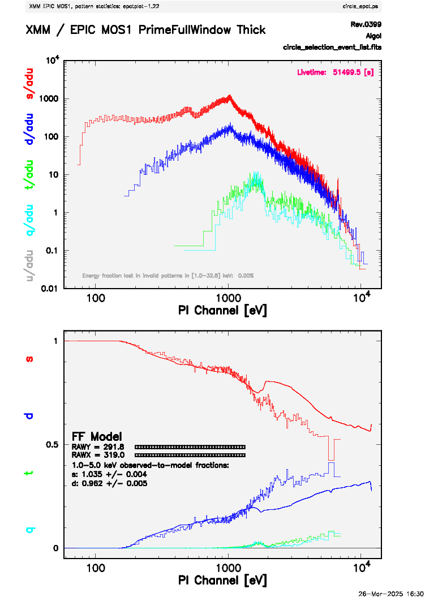
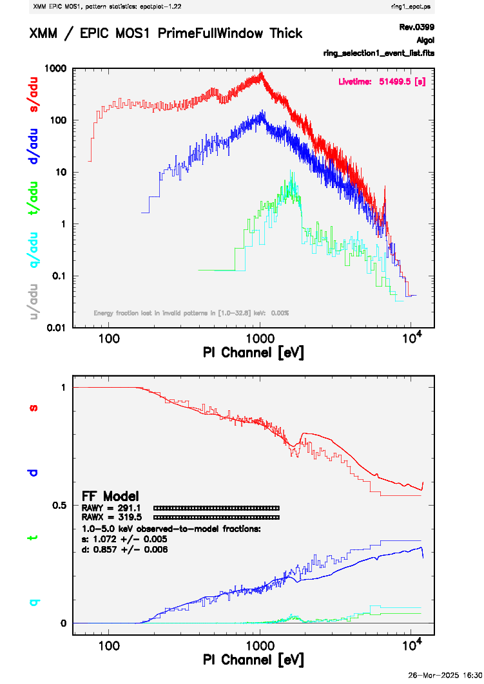
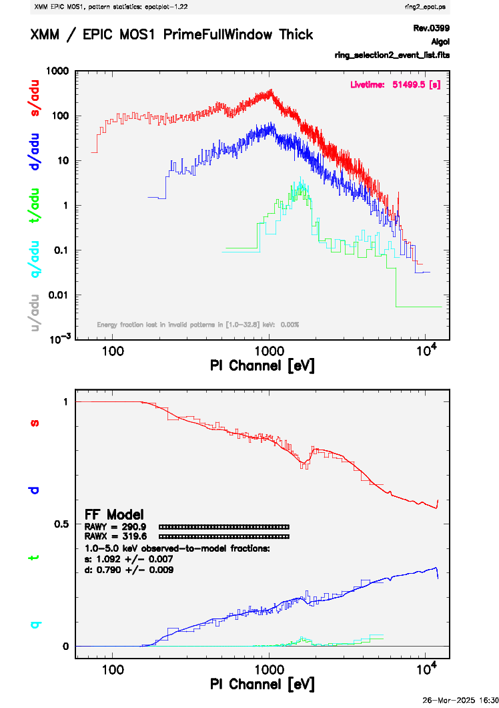

---
jupyter:
  jupytext:
    text_representation:
      extension: .md
      format_name: markdown
      format_version: '1.3'
      jupytext_version: 1.16.0
  kernelspec:
    display_name: (xmmsas)
    language: python
    name: conda-env-xmmsas-py
---

# Dealing with Pile-up in an EPIC Source
<hr style="border: 2px solid #fadbac" />

- **Description:** Introduction on how to deal with pile-up from a bright source.
- **Level:** Intermediate
- **Data:** XMM observation of Algol (obsid=0112880701)
- **Requirements:** Must be run using the `HEASARCv6.35` image. Run in the <tt>(xmmsas)</tt> conda environment on Sciserver. You should see <tt>(xmmsas)</tt> at the top right of the notebook. If not, click there and select <tt>(xmmsas)</tt>.
- **Credit:** Ryan Tanner (March 2025)
- **Support:** <a href="https://heasarc.gsfc.nasa.gov/docs/xmm/xmm_helpdesk.html">XMM Newton GOF Helpdesk</a>
- **Last verified to run:** 26 March 2025, for SAS v22.1 and pySAS v1.4.8

<hr style="border: 2px solid #fadbac" />


## Introduction
This tutorial is a supplement to the introductory notebooks on extracting a source in from EPIC data (XMM-Newton ABC Guide, Chapter 6, [Part 1](./analysis-xmm-ABC-guide-ch6-p1.ipynb) and [Part 2](./analysis-xmm-ABC-guide-ch6-p2.ipynb)). This notebook assumes you are at least minimally familiar with pySAS on SciServer (see the [Long pySAS Introduction](./analysis-xmm-long-intro.md "Long pySAS Intro")) and that you have previously worked through the two introductory notebooks. This tutorial is partially based on the SAS thread [How to evaluate and test pile-up in an EPIC source](https://www.cosmos.esa.int/web/xmm-newton/sas-thread-epatplot).

We will be using a bright x-ray source (the star Algol) to demonstrate the pile-up effect. We will not be filtering the data, as demonstrated in previous notebooks, but will be using the unfiltered event list. Normally you should filter your data first and produce a Good Time Interval (GTI) file.

In Part 1 we breifly mentioned how to check for pile-up, which occurs whenever an X-ray source is too bright for the selected read-out mode, thus in practice is like an overexposure effect. There are two ways pile-up occurs.

    -Pattern pile-up: During a single read-out cycle more than one photon is detected in two or more adjacent pixels. During the read-out, the electronics cannot distinguish whether signals in adjacent pixels originate from one or more photons, thus two or more photons are erroneously combined to an individual event of higher pattern type, e.g. two adjacent individual photons are erroneously combined to a double event whose energy is equal to the sum of the individual energies of the incoming photons.
    
    -Energy pile-up: During a single read-out cycle more than one photon hits the same pixel. During the read-out, the electronics cannot distinguish whether the signal in a pixel originates from one or more photons, thus a single event of erroneous energy is read whose energy is equal to the sum of the individual energies of the incoming photons.

The effect of pile-up on the spectra is therefore three-fold:

    -Photon loss, either due to the fact that one photon is "read" instead of several, or to the fact that the summed energy may assume values beyond the upper energy on-board threshold. Also, an invalid pattern could be produced and hence the photons lost.
    
    -Energy distortion, whereby photons are moved to higher X-ray regions of the spectrum.
    
    -Pattern migration, where the expected pattern distribution is distorted.

#### SAS Tasks to be Used

- `evselect`[(Documentation for evselect)](https://xmm-tools.cosmos.esa.int/external/sas/current/doc/evselect/index.html)
- `epatplot`[(Documentation for epatplot)](https://xmm-tools.cosmos.esa.int/external/sas/current/doc/epatplot/index.html)

#### Useful Links

- [`pysas` Documentation](https://xmm-tools.cosmos.esa.int/external/sas/current/doc/pysas/index.html "pysas Documentation")
- [`pysas` on GitHub](https://github.com/XMMGOF/pysas)
- [Common SAS Threads](https://www.cosmos.esa.int/web/xmm-newton/sas-threads/ "SAS Threads")
- [Users' Guide to the XMM-Newton Science Analysis System (SAS)](https://xmm-tools.cosmos.esa.int/external/xmm_user_support/documentation/sas_usg/USG/SASUSG.html "Users' Guide")
- [The XMM-Newton ABC Guide](https://heasarc.gsfc.nasa.gov/docs/xmm/abc/ "ABC Guide")
- [XMM Newton GOF Helpdesk](https://heasarc.gsfc.nasa.gov/docs/xmm/xmm_helpdesk.html "Helpdesk") - Link to form to contact the GOF Helpdesk.

<div style='color: #333; background: #ffffdf; padding:20px; border: 4px solid #fadbac'>
<b>Running On Sciserver:</b><br>
When running this notebook inside Sciserver, make sure the HEASARC data drive is mounted when initializing the Sciserver compute container. <a href='https://heasarc.gsfc.nasa.gov/docs/sciserver/'>See details here</a>.
<br><br>
<b>Running Outside Sciserver:</b><br>
This notebook was designed to run on SciServer, but an equivelent notebook can be found on <a href="https://github.com/XMMGOF/pysas">GitHub</a>. You will need to install the development version of pySAS found on GitHub (<a href="https://github.com/XMMGOF/pysas">pySAS on GitHub</a>). There are installation instructions on GitHub and example notebooks can be found inside the directory named 'documentation'.
<br>
</div>

<div class="alert alert-block alert-warning">
    <b>Warning:</b> By default this notebook will place observation data files in your <tt>scratch</tt> space. The <tt>scratch</tt> space on SciServer will only retain files for 90 days. If you wish to keep the data files for longer move them into your <tt>persistent</tt> directory.
</div>


## Basic Setup

```python
# pySAS imports
import pysas
from pysas.wrapper import Wrapper as w

# Importing Js9
import jpyjs9
my_js9 = jpyjs9.JS9(width = 800, height = 800, side=True)

# Useful imports
import os, subprocess

# Imports for plotting
import matplotlib.pyplot as plt
from astropy.visualization import astropy_mpl_style
from astropy.io import fits
from astropy.wcs import WCS
from astropy.table import Table
plt.style.use(astropy_mpl_style)
```

```python
obsid = '0112880701'

# To get your user name. Or you can just put your user name in the path for your data.
from SciServer import Authentication as auth
usr = auth.getKeystoneUserWithToken(auth.getToken()).userName

data_dir = os.path.join('/home/idies/workspace/Temporary/',usr,'scratch/xmm_data')
odf = pysas.odfcontrol.ODFobject(obsid)
odf.basic_setup(data_dir=data_dir,overwrite=False,repo='sciserver',rerun=False,
                run_epproc=False,run_rgsproc=False)
os.chdir(odf.work_dir)
```

```python
# File names for this notebook. The User can change these file names.
unfiltered_event_list = odf.files['M1evt_list'][0]
light_curve_file = 'ltcrv.fits'
circle_selection = 'circle_selection_event_list.fits'
ring_selction1 = 'ring_selection1_event_list.fits'
ring_selction2 = 'ring_selection2_event_list.fits'
circle_epat = 'circle_epat.ps'
ring1_epat = 'ring1_epat.ps'
ring2_epat = 'ring2_epat.ps'
```

```python
def display_fits_image(event_list_file, image_file='image.fits'):
    
    inargs = ['table={0}'.format(event_list_file), 
              'withimageset=yes',
              'imageset={0}'.format(image_file), 
              'xcolumn=X', 
              'ycolumn=Y', 
              'imagebinning=imageSize', 
              'ximagesize=600', 
              'yimagesize=600']

    w('evselect', inargs).run()

    with fits.open(image_file) as hdu:
        my_js9.SetFITS(hdu)
        my_js9.SetColormap('heat',1,0.5)
        my_js9.SetScale("log")
    
    return image_file
```

```python
def plot_light_curve(event_list_file, light_curve_file='ltcrv.fits'):
                     
    inargs = ['table={0}'.format(event_list_file), 
              'withrateset=yes', 
              'rateset={0}'.format(light_curve_file), 
              'maketimecolumn=yes', 
              'timecolumn=TIME', 
              'timebinsize=100', 
              'makeratecolumn=yes']

    w('evselect', inargs).run()

    ts = Table.read(light_curve_file,hdu=1)
    plt.plot(ts['TIME'],ts['RATE'])
    plt.xlabel('Time (s)')
    plt.ylabel('Count Rate (ct/s)')
    plt.show()
```

```python
def filter_region(input_event_list,output_event_list,x,y,radius,type='circle'):
    my_js9.RemoveRegions('all')
    if type == 'circle':
        my_js9.AddRegions(type, {'px': x, 'py': y, 'radius': radius})
        regions = my_js9.GetRegions()
        source_region = regions[0]
        source_loc = source_region['lcs']
        expression = "'((X,Y) in CIRCLE({x:.1f},{y:.1f},{radius:.1f}))'".format(x=source_loc['x'],y=source_loc['y'],radius=source_loc['radius'])
    if type == 'annulus':
        my_js9.AddRegions(type, {'px': x, 'py': y, 'radii': radius})
        regions = my_js9.GetRegions()
        source_region = regions[0]
        source_loc = source_region['lcs']
        expression = "'((X,Y) in ANNULUS({x:.1f},{y:.1f},{radiusi:.1f},{radiuso:.1f}))'".format(x=source_loc['x'],y=source_loc['y'],radiusi=source_loc['radii'][0],radiuso=source_loc['radii'][1])
    
    inargs = {'table' : input_event_list,
              'withfilteredset' : 'yes',
              'filteredset' : output_event_list,
              'keepfilteroutput' : 'yes',
              'filtertype': 'expression',
              'expression': expression}
    
    w('evselect', inargs).run()
```

```python
display_fits_image(unfiltered_event_list)
```

This following cell is not necessary for what we are doing here, but is good to check that the data for this observation is generally free from flares and other contamination.

```python
plot_light_curve(unfiltered_event_list, light_curve_file=light_curve_file)
```

## Using `epatplot` to check for pile-up

The output of `epatplot` is a postscript file, which may be viewed with a postscript viewer such as `gv` (i.e. 'ghostscript viewer'). At the moment there is no way to view a postscript file on SciServer so to view it you will have to download the postscript file to your local machine to view it. If you do not have `gv` installed on your local machine, install it from a terminal using `sudo apt install gv`. Then from the download directory you can run `gv file_name.ps` (with `file_name` being the name of the file) to view the graphs.

First we will use a circle region to select the source. The (x,y) coordinates of the source have been determined before hand.

The following cell will extract the events inside the region using `evselect`, and write those events to a file `circle_selection_event_list.fits`. Then it will use `epatplot` to create the diagnostic plot `circle_epat.ps`.

As a reminder, all files created here can be found in the work directory for this Obs ID.

```python
print(odf.work_dir)
```

```python
filter_region(unfiltered_event_list,circle_selection,27536,27362,10,type='circle')
inargs = ['set={0}'.format(circle_selection),
          'plotfile={0}'.format(circle_epat),
          'useplotfile=yes',
          "pileupnumberenergyrange='1000 5000'"]

w('epatplot', inargs).run()
```

The resulting plot should look like this:
<center></center>


The important thing to note here is the difference between the the data (histogram) and the model (solid lines). This indicates the presence of pile-up.
<center></center>


To address the pile-up, instead of using a circular region we will use and annulus to cut out the very center of the bright source. We will use `evselect` again to create an event list with just the events from the annulus region, and then run that through `epatplot`. The new plot will be named `ring1_epat.ps`.

```python
filter_region(unfiltered_event_list,ring_selction1,27536,27362,[2,10],type='annulus')
inargs = ['set={0}'.format(ring_selction1),
          'plotfile={0}'.format(ring1_epat),
          'useplotfile=yes',
          "pileupnumberenergyrange='1000 5000'"]

w('epatplot', inargs).run()
```

The resulting plot should look like this:

<center></center>


While the data is closer to the model, there is still a difference. We can improve on this by making the inner radius of the annulus larger to cut out a larger area.

```python
filter_region(unfiltered_event_list,ring_selction2,27536,27362,[4,10],type='annulus')
inargs = ['set={0}'.format(ring_selction2),
          'plotfile={0}'.format(ring2_epat),
          'useplotfile=yes',
          "pileupnumberenergyrange='1000 5000'"]

w('epatplot', inargs).run()
```

The resulting plot should look like this:

<center></center>


The data now closely matches the model and pile-up has been sucsessfully minimized. The final filtered event list, `ring_selection2_event_list.fits`, can now be used to extract a spectrum as shown in [Part 2 tutorial](./analysis-xmm-ABC-guide-ch6-p2.ipynb) on filtering and extracting a spectrum.
